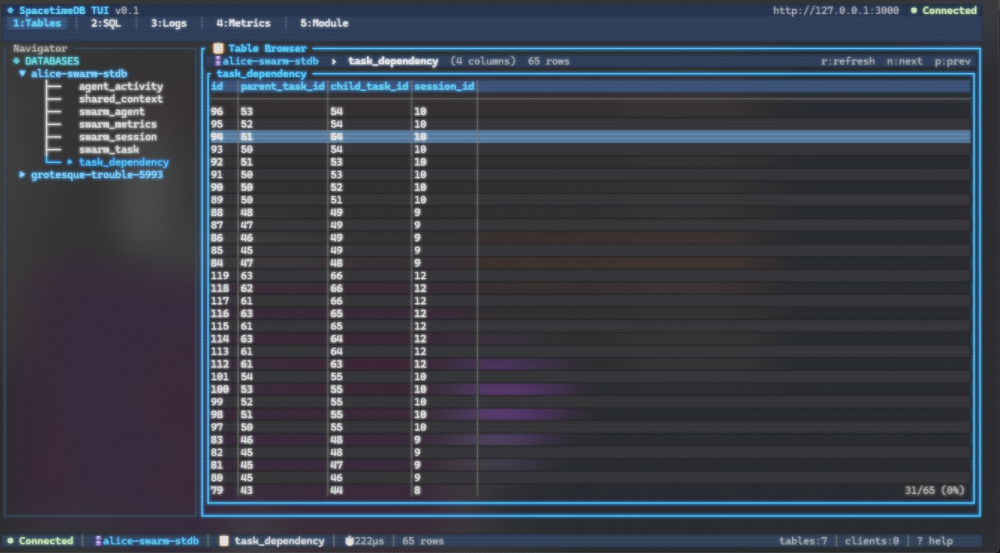
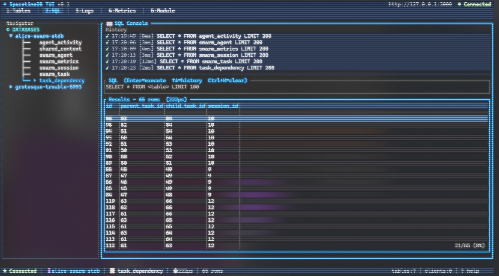
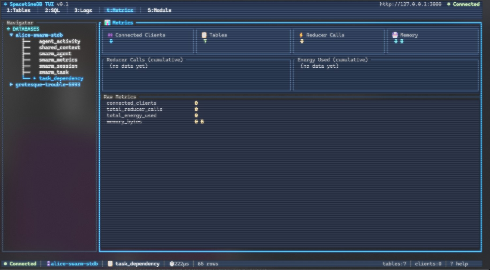
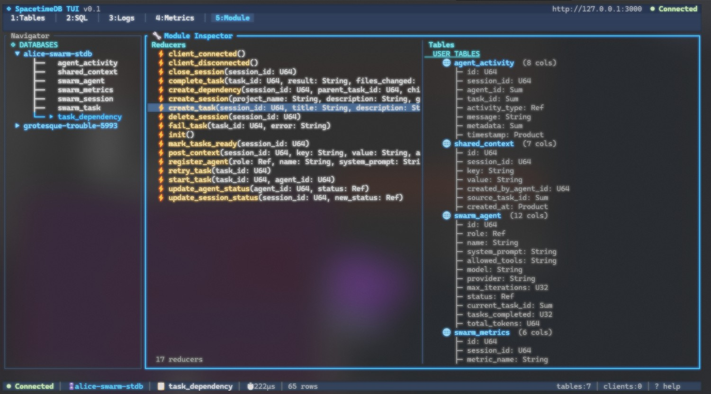

# 🛸 spacetimedb-tui

> **A blazing-fast, keyboard-driven terminal UI for managing, querying, and monitoring SpacetimeDB 2.0 — right from your shell.**

> [!WARNING]
> **This project is under active development.** Features may be incomplete, APIs may change, and bugs are expected. Contributions and bug reports are welcome!

[](./LICENSE)
[](https://spacetimedb.com)
[](https://www.rust-lang.org)

---

## 📸 Screenshots

| Database Browser | SQL Console |
|:---:|:---:|
|  |  |

| Metrics Viewer | Module Inspector |
|:---:|:---:|
|  |  |

---

## ✨ Features

| Feature | Description |
|---|---|
| 🗄️ **Database Browser** | Navigate all your SpacetimeDB databases and schemas in a tree-style sidebar. Switch between databases instantly. |
| 📊 **Live Table Viewer** | Stream real-time row updates from any table via SpacetimeDB subscriptions. Rows highlight on insert, update, and delete. |
| 🖥️ **SQL Console** | Write and execute ad-hoc SQL queries with query history (↑/↓) and results rendered in a scrollable grid. |
| 📜 **Log Viewer** | Tail and filter structured logs emitted by your SpacetimeDB modules. Supports level filtering and regex search. |
| 📈 **Metrics Dashboard** | Live sparklines and counters for connections, queries/sec, memory, CPU, and row throughput. |
| 🔬 **Module Inspector** | Browse deployed WASM modules: view reducer signatures, scheduled reducers, and table definitions. |
| ⌨️ **Keyboard-First UX** | Every action is reachable without a mouse. Vim-style navigation, fuzzy search, and modal panels. |
| 🔐 **Auto Auth** | Automatically reads your SpacetimeDB CLI credentials from `~/.config/spacetime/cli.toml` — zero config needed. |

---

## 🚀 Installation

### Prerequisites

- **Rust 1.78+** — install via [rustup](https://rustup.rs)
- A running **SpacetimeDB 2.0** instance (local or remote)
- **SpacetimeDB CLI** configured (`spacetime login` or local server)

---

### Build from Source

```bash
# 1. Clone the repository
git clone https://github.com/RazieLDG/spacetimedb-tui.git
cd spacetimedb-tui

# 2. Build an optimised release binary
cargo build --release

# 3. (Optional) copy to a directory on your PATH
cp target/release/spacetimedb-tui ~/.local/bin/
```

---

## 🖥️ Usage

### Quick Start

`spacetimedb-tui` automatically reads your SpacetimeDB CLI config from `~/.config/spacetime/cli.toml`, so in most cases you can just run:

```bash
# Connect using your existing SpacetimeDB CLI credentials
spacetimedb-tui

# Specify a database to open on startup
spacetimedb-tui --database my_game_db

# Connect to a specific host
spacetimedb-tui --host db.example.com --port 3000

# Provide a token explicitly
spacetimedb-tui --host localhost --port 3000 --token $STDB_TOKEN
```

---

### CLI Reference

| Flag | Short | Default | Description |
|---|---|---|---|
| `--host <HOST>` | `-H` | *from cli.toml* | SpacetimeDB server hostname or IP |
| `--port <PORT>` | `-p` | `3000` | SpacetimeDB server port |
| `--database <DB>` | `-d` | *(none)* | Database to select on startup |
| `--token <TOKEN>` | `-t` | *from cli.toml* | SpacetimeDB identity/auth token |
| `--version` | `-V` | | Print version and exit |
| `--help` | `-h` | | Print help and exit |

### Auto-Configuration

The TUI reads credentials from SpacetimeDB's CLI config file:

```
~/.config/spacetime/cli.toml
```

This file is created when you run `spacetime login` or `spacetime start`. It contains:
- Your **auth token** (JWT with embedded identity)
- Your **default server** hostname and port

If this file exists, you don't need to pass `--host`, `--port`, or `--token` manually.

---

## ⌨️ Key Bindings

### Global

| Key | Action |
|---|---|
| `Tab` / `Shift+Tab` | Cycle focus between panels |
| `q` | Quit the application |
| `?` | Toggle help overlay |
| `F5` | Force refresh current panel |
| `Ctrl+c` | Quit immediately |
| `1`–`5` | Jump directly to panel 1–5 |

### Navigation

| Key | Action |
|---|---|
| `↑` / `k` | Move selection up |
| `↓` / `j` | Move selection down |
| `Enter` | Select / confirm / open |
| `Esc` | Cancel / close modal |
| `PgUp` / `PgDn` | Scroll page up / down |
| `g` / `G` | Jump to first / last row |

### SQL Console

| Key | Action |
|---|---|
| `Enter` | Execute query |
| `↑` / `↓` | Navigate query history |
| `Ctrl+k` | Clear input buffer |

---

## 🪐 SpacetimeDB 2.0 Compatibility

Built and tested against **SpacetimeDB 2.0** HTTP + WebSocket APIs.

| SpacetimeDB Version | Supported | Notes |
|---|---|---|
| **2.0.x** | ✅ Full support | Primary target |
| **1.x** | ❌ Not supported | Breaking API differences |

### API Endpoints Used

| Feature | Endpoint |
|---|---|
| Schema inspection | `GET /v1/database/{db}/schema?version=9` |
| SQL execution | `POST /v1/database/{db}/sql` |
| Database listing | `GET /v1/identity/{id}/databases` |
| Log streaming | `GET /v1/database/{db}/logs` |

---

## 🤝 Contributing

Contributions are welcome! Whether it's a bug fix, new feature, or documentation improvement.

### Reporting Bugs

Please [open an issue](https://github.com/RazieLDG/spacetimedb-tui/issues/new) and include:
- Your OS and terminal emulator
- `spacetimedb-tui --version` output
- SpacetimeDB server version (`spacetime version`)
- Steps to reproduce

---

## 📄 License

MIT License — Copyright © 2026 **Beyond Horizons Industries**

See [LICENSE](./LICENSE) for the full text.

---

<div align="center">

Built by [Alice AI](https://aliceos.ai) · Beyond Horizons Industries

*Exploring the SpacetimeDB universe, one terminal at a time.* 🛸

</div>
