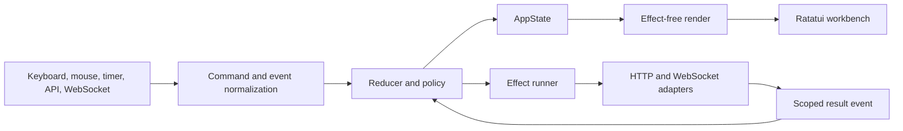
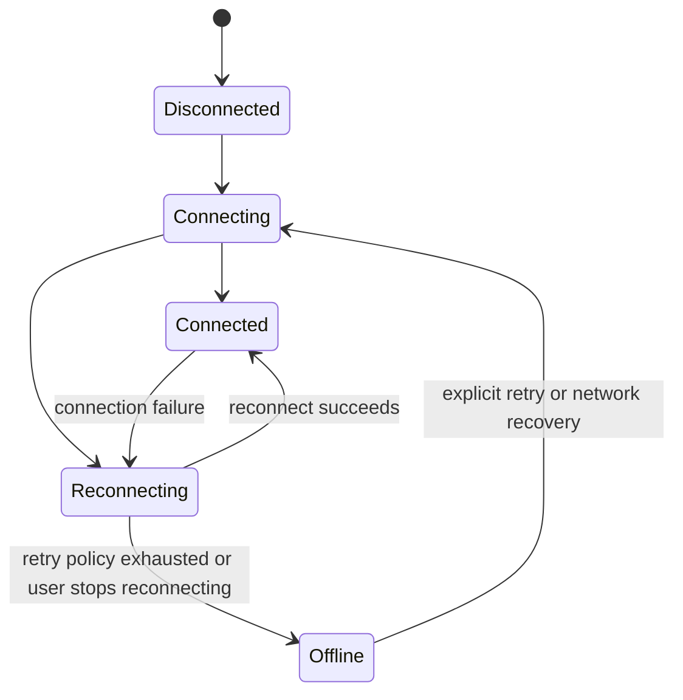

# Contextual Workbench UX and Reliability Design

**Date:** 2026-07-26

**Status:** Design direction approved, specification pending user review

**Project:** `spacetimedb-tui`

## 1. Summary

This design turns `spacetimedb-tui` into a contextual workbench that is safe for guided data operations, understandable for new users, and fast for expert users.

The chosen direction has five defining properties:

1. **Progressive disclosure:** primary actions are visible, while advanced actions live in the Inspector and command palette.
2. **Keyboard-first interaction:** every supported mouse action maps to the same typed command as its keyboard equivalent.
3. **Scoped asynchronous state:** every state-changing API or WebSocket result identifies the request or subscription that produced it.
4. **Verified guided writes:** row update and delete operations require the complete declared primary key and never infer a key from an arbitrary column.
5. **Bounded live data:** row subscriptions are opt-in, active-resource scoped, deduplicated, and constrained by explicit memory budgets.

The work is delivered in safety-first vertical phases. It is not a big-bang rewrite.

## 2. Approved product decisions

The design is based on the following approved choices:

- The target audience includes both new and expert users.
- Progressive disclosure is preferred over separate beginner and expert interfaces.
- Delivery priority is:
  1. data safety and crash resistance
  2. navigation and feedback
  3. performance and live-data behavior
- A comprehensive navigation and keybinding redesign is allowed.
- The product remains keyboard-first.
- Mouse support is added for focus, selection, tabs, scrolling, and modal actions.
- Every mouse action must have keyboard parity.
- The selected information architecture is **Contextual Workbench**.
- Visual brainstorming artifacts remain outside the project directory. Only this text specification is committed.

## 3. Current-state findings

The existing project has a solid baseline. Formatting, warning-denied Clippy, 127 tests, release compilation, and installer shell syntax passed during the initial audit. The main risks are architectural and behavioral rather than a generally broken build.

### 3.1 Safety and correctness risks

- `src/app.rs::pick_primary_key` can fall back to naming conventions and ultimately the first column.
- Guided row update and delete can therefore target more than one row when no real primary key exists or when a composite primary key is reduced to one field.
- Several asynchronous `AppEvent` variants do not identify the database, table, request, or generation that originated them.
- A late response can overwrite state after the user has navigated to another resource.
- Mutation outcomes are not modeled separately from safely retryable reads.

### 3.2 Stability and recovery risks

- SQL history width arithmetic can underflow in narrow terminals.
- SQL truncation slices UTF-8 strings at byte offsets and can panic on a non-ASCII boundary.
- Terminal restoration runs after the main loop returns, but there is no RAII guard that restores terminal state during all setup failures and panics.
- WebSocket reconnect handling can duplicate subscriptions, treats recoverable server failures too harshly, and does not consistently reset backoff after a stable connection.
- Upward navigation can change selection without triggering the same schema reload path as other navigation actions.

### 3.3 Resource and product-truth risks

- The live-data path subscribes to every user table with `SELECT *` and retains full snapshots.
- The cache has no explicit row or byte budget.
- `UserConfig` derives `Default`, which makes `restore_session` false in the missing-file path even though deserialization documents a default of true.
- CLI default values are sometimes used as a proxy for whether the user explicitly supplied an option.
- Custom themes can be loaded from config but cannot be named through the current CLI enum.
- `spawn_log_follow` exists but is not connected to the claimed live-log experience.
- The documented Rust 1.78 minimum does not match the current locked dependency requirements.
- Version metadata and release artifacts are not consistently validated together.
- Installers do not verify downloaded artifact checksums.

### 3.4 Maintainability risk

`src/app.rs` is approximately 4,000 lines. Its `handle_key` function is approximately 700 lines. Event-loop control, input mapping, navigation, async work, write construction, state transitions, modal behavior, and rendering coordination are coupled in one module. Some widget state also lives in `App` while related domain state lives in `AppState`, which creates multiple ownership points.

## 4. Goals

### 4.1 User goals

- A new user can discover the database, table, inspect, query, and guided edit flows without memorizing shortcuts.
- An expert user can invoke the same flows directly through consistent shortcuts and the command palette.
- The current database, resource, selection, connection state, and background work remain visible.
- Loading, refreshing, empty, stale, offline, retrying, and error states are distinct and actionable.
- Destructive actions explain their exact target before execution.
- Narrow terminals degrade to a simpler interface instead of panicking.

### 4.2 Engineering goals

- Establish a single source of truth for application and widget state.
- Route keyboard, mouse, palette, and help through one typed command registry.
- Make read request completion scope-aware and generation-aware.
- Separate safely retryable reads from non-idempotent mutations.
- Guarantee that guided writes use a complete declared primary key.
- Bound row-cache growth and active row subscriptions.
- Make reconnect behavior deterministic and subscription-idempotent.
- Split `app.rs` through behavior-preserving, test-backed extraction.
- Make documentation, release metadata, and installers truthful and verifiable.

## 5. Non-goals

- Replacing Ratatui or rewriting the application in another language.
- Replacing SpacetimeDB's HTTP or WebSocket protocols.
- Removing raw SQL from expert users.
- Claiming that guided CRUD rules can make arbitrary raw SQL safe.
- Implementing optimistic guided writes in the first version.
- Maintaining two complete UI architectures for an extended period.
- Committing visual companion HTML or state into this repository.

## 6. Information architecture

The top-level experience is organized into three modes:

- **DATA:** table browsing and SQL workspaces.
- **OBSERVE:** scope-aware live transactions, logs, and metrics.
- **OPERATE:** reducers, module information, and database-level operations.

User-visible capabilities are rehomed where they can preserve the approved safety invariants. Unsafe implicit multi-row save and unbounded all-table Live behavior are intentionally narrowed rather than preserved.

### 6.1 Wide layout, at least 120 columns by 20 rows

```text
┌ DATA  OBSERVE  OPERATE ───────── database / resource ─ Ctrl+P ┐
├─────────────────┬──────────────────────────┬───────────────────┤
│ Explorer        │ Workspace                │ Inspector         │
│ databases       │ table, SQL, logs, etc.   │ context, schema,  │
│ resources       │                          │ safe actions      │
├─────────────────┴──────────────────────────┴───────────────────┤
│ Connection · lifecycle · activity                shortcuts     │
└───────────────────────────────────────────────────────────────┘
```

### 6.2 Medium layout, at least 90 columns by 16 rows

- Explorer and workspace remain visible.
- Inspector becomes a right-side drawer.
- Status text uses shorter labels while preserving state meaning.

### 6.3 Compact layout, at least 40 columns by 12 rows

- One primary panel is visible at a time.
- A quick switcher moves between Explorer, workspace, and Inspector.
- Breadcrumb and connection state remain available.

### 6.4 Tiny layout

Layout selection uses width and height together. The application chooses the richest mode whose complete minimum fits. A wide terminal with insufficient height downgrades to Medium or Compact rather than clipping panes.

If width is below 40 columns or height is below 12 rows, the application renders a minimal `terminal too small` screen. It never performs unchecked rectangle subtraction and never panics.

### 6.5 Workbench responsibilities

- **Explorer:** database and resource navigation, filtering, and counts where bounded metadata is available.
- **Workspace:** the active table, SQL session, log view, metric view, or operation form.
- **Inspector:** selection details, schema, capabilities, safe actions, and contextual explanation.
- **Activity bar and panel:** connection status, active requests, retries, recent outcomes, and technical error details.
- **Breadcrumb:** current mode, database, resource, and selection context.

## 7. Interaction model

### 7.1 Typed command registry

A central command registry defines each user action once.

Each command specification contains:

- a stable command identifier
- a user-facing label and description
- default keybindings
- valid modes and focus contexts
- an availability policy
- a disabled reason
- the typed action produced on invocation

Keyboard input, mouse hit targets, the command palette, and contextual help resolve to the same command identifier. UI enablement and actual execution use the same policy, so a disabled action cannot bypass the policy through another input route.

Core global interactions are:

- `Ctrl+P`: open command palette
- `?`: open contextual help
- `Esc`: close the top transient surface or navigate one semantic level back
- `Tab` and `Shift+Tab`: move focus between available panes

Existing non-conflicting shortcuts remain aliases for one release cycle. The new keymap is primary and contextual help explains aliases during migration.

### 7.2 Mouse parity

Mouse support covers:

- pane focus
- row and cell selection
- mode and workspace tabs
- wheel scrolling
- modal buttons and choices

A mouse handler may perform hit testing, but it must emit a registered command. No mouse-only state transition is allowed.

### 7.3 Navigation as a state transition

Navigation is not a direct cursor mutation. Commands such as `SelectDatabase`, `SelectResource`, `NavigateUp`, and `RestoreSession` pass through the reducer. The reducer updates selection and emits any required schema or data effect in one transition. This prevents paths such as `nav_up` from changing the visible selection without loading its resource.

## 8. Component architecture

The application adopts an Elm-like unidirectional data flow without introducing a new UI framework.



### 8.1 Rules

- Rendering is effect-free. It may update isolated Ratatui widget bookkeeping when the framework requires mutable widget state, but it cannot change domain selection, request lifecycle, or start network work.
- Network tasks never mutate application state directly.
- The reducer is the only place that applies domain state transitions.
- The reducer may emit typed effects.
- Every state-changing async result carries a request context or subscription key.
- Widget state such as grid cursor, SQL input, pane focus, palette state, and modal state belongs to the central state tree.
- Derived capabilities are computed from authoritative schema and lifecycle state instead of copied into multiple mutable fields.

### 8.2 Proposed module boundaries

```text
src/
├── app/
│   ├── mod.rs          # App shell and event loop
│   ├── command.rs      # Command IDs, registry, bindings, availability
│   ├── event.rs        # Normalized input and scoped result events
│   ├── reducer.rs      # State transitions and effect emission
│   ├── navigation.rs   # Semantic navigation transitions
│   └── policy.rs       # Shared capability and safety policies
├── effects/
│   ├── mod.rs
│   ├── runner.rs       # Task ownership and completion routing
│   ├── request.rs      # Request IDs, scope, generation, cancellation
│   ├── subscription.rs # Desired/active subscription reconciliation
│   └── write_ops.rs    # Validated WritePlan execution
├── state/
│   ├── app_state.rs
│   ├── navigation.rs
│   ├── resources.rs
│   ├── workbench.rs
│   ├── activity.rs
│   └── safety.rs
├── ui/
│   ├── workbench.rs
│   ├── explorer.rs
│   ├── inspector.rs
│   ├── activity.rs
│   ├── states.rs       # Shared loading, refreshing, empty, stale, offline, retrying, error views
│   └── ...             # Existing reusable components and workspace views
└── api/                # Existing HTTP and WebSocket transport adapters
```

This is a target boundary, not a requirement to create every file before useful behavior ships. Extraction proceeds in small commits with tests around existing behavior.

### 8.3 Deterministic runtime ports

The reducer and effect runner depend on narrow runtime ports instead of concrete global services:

- `ApiTransport` for reads and mutations
- `SubscriptionTransport` for connection and subscription tasks
- `Clock` and `Sleeper` for deadlines and retry countdowns
- `BackoffPolicy` with an injected deterministic randomness source
- `IdSource` for request, operation, connection, and subscription generations
- `TaskRegistry` for structured task ownership, cancellation, joining, and panic reporting
- `TerminalOps` for raw mode, alternate screen, mouse capture, cursor, and restoration tests

Production adapters wrap Reqwest, Tokio, Tungstenite, Crossterm, and the real clock. Tests use deterministic fakes. The effect runner owns spawned work through a structured registry such as `JoinSet`. Safety-relevant tasks are not detached.

## 9. State model

```rust
struct AppState {
    navigation: NavigationState,
    resources: ResourceState,
    workbench: WorkbenchState,
    activity: ActivityState,
    safety: SafetyState,
}
```

### 9.1 Navigation state

Owns:

- active database
- active resource
- active mode and workspace
- selection identity
- restorable navigation state

Persisted `user_config::SessionState` is an I/O representation that maps into and out of `NavigationState`. It is not a second mutable runtime owner.

### 9.2 Resource state

Owns database, schema, table, query, log, and metric data by stable scope.

```rust
enum LoadState<T> {
    Idle,
    Loading { request: RequestContext },
    Ready { data: T, refreshed_at: Instant },
    Refreshing { data: T, request: RequestContext },
    Empty { refreshed_at: Instant },
    Stale { data: T, reason: StaleReason },
    Error { previous: Option<T>, error: AppError },
}
```

Existing data stays visible during a refresh and gains a `refreshing` or `stale` marker. Initial loading uses a contextual placeholder. A global spinner does not block unrelated work.

`Retrying` and `Offline` are derived resource presentations, not duplicate data containers. They combine `LoadState<T>` with the active request and connection state:

| Condition | Presentation |
|---|---|
| No data and a read is running | Loading |
| Existing data and a read is running | Refreshing |
| A bounded read retry is scheduled | Retrying with attempt and countdown |
| Cached data cannot refresh because the connection is offline | Stale and Offline |
| Successful response with no rows | Empty |
| Non-recoverable failure | Error with contextual action |

### 9.3 Workbench state

Owns:

- responsive layout mode
- focused pane
- Inspector and drawer state
- SQL editor and history cursor
- table grid cursor and search
- palette, help, modal, and edit surfaces

### 9.4 Activity state

Owns:

- active reads and mutations
- retries and retry countdowns
- connection lifecycle
- recent success, warning, and error notices
- technical details and correlation identifiers

### 9.5 Safety state

Owns in-progress write plans, confirmation state, and unresolved mutation outcomes. Command capabilities themselves are derived from schema, selection, connection, and freshness state.

## 10. Scoped request lifecycle

```rust
struct RequestContext {
    id: RequestId,
    scope: RequestScope,
    generation: u64,
}
```

A request scope includes enough identity to prevent unrelated work from colliding. Examples include:

- database catalog
- schema for a database
- rows for a database, table, and view
- a SQL workspace execution
- logs for a database
- metrics for a database

### 10.1 Read flow

1. A command requests data for a scope.
2. The reducer increments that scope's generation and records its latest request.
3. If no prior data exists, the scope enters `Loading`.
4. If prior data exists, it remains visible in `Refreshing`.
5. The effect runner starts a cancellable read with the request context.
6. Completion returns as a scoped event.
7. The reducer applies it only when request ID, scope, and generation are still current.
8. A late or cancelled result is ignored and may be logged at debug level.

Changing resource intent cancels conflicting reads. Cancellation is cooperative, so generation checks remain mandatory even after cancellation is requested.

### 10.2 Mutation flow

Mutations are not treated like cancellable reads. Their safety boundary is transport ownership, not an unreliable guess about whether bytes reached the server.

- A pending confirmation is cancellable. Cancellation before `ApiTransport` ownership is `DefinitelyNotSent`.
- Before the request is handed to `ApiTransport`, validation or construction failure is `DefinitelyNotSent` and may be retried after correction.
- Once `ApiTransport` accepts the request for dispatch, any timeout, disconnect, cancellation, or transport error without an authoritative application response is `Unknown`.
- An adapter may return `DefinitelyNotSent` after dispatch starts only when it can prove that no request bytes were transmitted.
- A mutation HTTP 5xx is `Unknown` unless the endpoint contract authoritatively guarantees that the mutation did not execute.
- After dispatch starts, navigation does not erase the operation from Activity.
- The result is routed back to its resource even when it is no longer visible.
- An `Unknown` operation is never automatically retried. The affected scope must be refreshed or otherwise verified first.

### 10.3 Subscription events

V1 uses one row query-set per WebSocket connection because the modeled protocol exposes `request_id` on `InitialSubscription` but not on `TransactionUpdate`, and the current adapter has no verified unsubscribe command.

Each subscription task is created with a local context:

```rust
struct SubscriptionContext {
    key: SubscriptionKey,
    task_generation: u64,
    connection_generation: u64,
    request_id: u32,
}
```

- The task attaches the current socket attempt's local context to every event it emits.
- `InitialSubscription.request_id` must match before the subscription becomes Active.
- Later `TransactionUpdate` messages inherit the owning task's context. They do not claim a wire-level subscription identifier that the protocol did not provide.
- Changing desired row scope closes and joins the old task, drops its receiver, increments the task generation, and creates a new task.
- Each initial connect or reconnect advances the connection generation and uses a fresh request ID.
- Late events from an old task or socket attempt carry an old generation and are ignored.
- Reconnect inside one task sends its one current query-set exactly once and waits for a matching initial acknowledgement before returning to Active.

## 11. Safe guided writes

### 11.1 Validated WritePlan

Guided update and delete start by constructing a validated `WritePlan`.

```rust
struct WritePlan {
    id: WritePlanId,
    table: QualifiedTable,
    original_primary_key: CompletePrimaryKey,
    schema_generation: u64,
    row_generation: u64,
    server_context_generation: u64,
    database_generation: u64,
    mutation: GuidedMutation,
}
```

`CompletePrimaryKey` is built from raw typed row values, never display strings. Its validated constructor requires:

- a non-empty declared primary-key column list
- each declared column ID to be unique and within the schema's column range
- every declared column to be resolved exactly once in schema order
- every component value to exist and be non-null
- every component to have a type-correct SQL representation

Duplicate, unknown, missing, null, or unrepresentable components disable guided writes.

### 11.2 Required gates

A guided write is available only when:

- schema is loaded and current
- the server declares a primary key
- every component of a composite primary key is available
- the selected row belongs to the current schema and row generation
- the server context and database generation still match the plan's target
- no unresolved mutation already locks the same row

If any gate fails, the action is disabled and the Inspector explains why.

This guided-write safety policy is mandatory in V1. There is no unsafe override inside the row editor. Experts who intentionally need an unverified operation retain the separately labeled raw SQL path.

Opening a confirmation does not permanently authorize its plan. Accepting confirmation emits `ConfirmWritePlan(plan_id)`, and the reducer revalidates schema generation, row generation, server context generation, database generation, complete raw key tuple, changed fields, and row lock immediately before handing anything to `ApiTransport`. A mismatch aborts locally as `DefinitelyNotSent`, marks the view stale when appropriate, and offers refresh. No SQL is dispatched from a stale modal.

### 11.3 SQL construction rules

- No naming heuristic is accepted as a primary key.
- There is no first-column fallback.
- Composite primary keys use every component in the predicate.
- If a primary-key value is edited, the update predicate uses the original complete tuple.
- SQL value encoding continues through type-aware, tested literal construction.
- Table and column identifiers use a tested, dialect-aware identifier encoder and are never interpolated from unvalidated display strings.
- Bulk operations require a separate explicit design and are not inferred from a single-row action.

### 11.4 User flow

1. The Inspector presents the selected database, table, and exact key tuple.
2. Update shows changed fields. Delete shows a destructive summary.
3. The user confirms.
4. Only the affected row enters a pending visual state.
5. The mutation executes without optimistic success.
6. The result is verified.

### 11.5 Result verification

- If affected-row count is available, exactly one row is expected.
- Zero rows becomes a conflict or not-found outcome.
- More than one row becomes a critical safety error, marks the resource stale, and disables further guided writes until refresh.
- If affected-row count is unavailable, verification evaluates an explicit postcondition rather than treating any re-fetch as success.
- A normal update re-fetches the original complete key tuple and compares every intended changed field.
- A primary-key update re-fetches the new complete key tuple, compares every intended changed field, and verifies that the old tuple no longer resolves.
- A delete re-fetches the original complete key tuple and requires it to be absent.
- Any non-authoritative outcome after transport ownership begins is `Unknown`. The application does not auto-retry and requires refresh before another attempt.

Raw SQL remains an expert path. It must be visually distinct and must not display the guided CRUD safety guarantee. Freeform SQL is never automatically retried because client-side statement classification cannot prove idempotency.

V1 guarantees exact row identity, changed-field mutation, and post-operation verification. When the server exposes no version or compare-and-set token, it does not claim serializable conflict prevention against a concurrent writer. A stale row must refresh before guided mutation, and a future server version token should become a WritePlan precondition when available.

### 11.6 Spreadsheet editing contract

V1 preserves spreadsheet-style cell editing with a deliberately single-row save scope:

- Multiple changed cells in one row form one `WritePlan` and one `UPDATE` statement.
- One confirmation summarizes the row key and all changed fields.
- Starting an edit on another row while the current row is dirty presents Save, Discard, or Stay.
- The current behavior that queues edits across multiple rows and submits one independent statement per cell is disabled in Phase 1.
- Multi-row Save All, partial-batch continuation, and bulk rollback require a separate approved batch-write design.

This retains fast cell editing without presenting an unsafe multi-row batch as a single guided action.

## 12. Error and recovery model

### 12.1 Error classes

- **Validation and safety:** shown beside the field or action, with no automatic retry.
- **Authentication and permission:** shown as a session or resource-level banner with a corrective action.
- **Not found and conflict:** shown in the affected workspace with refresh or reselect actions.
- **Network and recoverable 5xx:** reads use bounded retry with jitter and a visible countdown.
- **Protocol and internal:** a concise user message appears in context, while technical details and a correlation identifier go to Activity.

Read retry defaults to a bounded policy. Mutation retry is never automatic unless the protocol later provides a verified idempotency mechanism.

### 12.2 WebSocket state machine



Backoff resets after a stable connection. HTTP 5xx and transient WebSocket failures do not terminate the TUI. `Connected` means only that the socket is open. Row Live becomes Active only after the current generation receives a matching `InitialSubscription.request_id`.

### 12.3 Subscription reconciliation

The V1 row-subscription controller owns one desired specification and at most one row-subscription task:

- **desired:** `Option<SubscriptionSpec>` derived from the active resource and Live toggle
- **task:** `Option<OwnedSubscriptionTask>` containing its specification, task generation, current socket context, and phase

Task phase is Connecting, Active, Reconnecting, or Closing. Active is a phase reached only after a matching initial acknowledgement, not a second owner.

Reconciliation follows these rules:

1. Desired `None` closes and joins any owned task.
2. Desired equal to the owned task's specification keeps that task. Connection loss changes its phase to Reconnecting without creating a second task.
3. Desired different from the owned task's specification closes and joins it, then creates a new task generation.
4. Each connect or reconnect creates a fresh connection generation and request ID, then sends only the task's one query-set.
5. The task enters Active only after a matching `InitialSubscription.request_id`.
6. A `TransactionUpdate` mutates row state only when its locally attached context equals the task context and phase is Active. Pre-ack, replaced, and stale-generation updates are ignored.

V1 does not assume wire-level correlation on `TransactionUpdate` and does not assume an unsubscribe operation. If a targeted server version later provides verified subscription identifiers and unsubscribe semantics, the transport adapter may optimize connection replacement without changing reducer invariants.

### 12.4 Terminal recovery

A `TerminalGuard` owns raw mode, alternate screen, mouse capture, and cursor restoration.

- It records a flag after each successful setup step so partial setup restores only capabilities that were enabled.
- Normal return restores the terminal.
- Error return restores the terminal.
- A panic unwinding through the main TUI owner restores the terminal through `TerminalGuard::drop`.
- The panic hook logs and delegates, but does not directly manipulate the terminal from an arbitrary background task.
- Spawned-task panics are joined and reported through Activity or the main error path instead of silently detaching.
- `Drop` performs best-effort cleanup, records failures without panicking, and is idempotent.
- Abort, double panic, forced process termination, and machine failure are outside the restoration guarantee.

## 13. Live data and resource budgets

### 13.1 Default behavior

- Table opening performs a bounded fetch or bounded query view. The initial target is 200 rows.
- The footer states the loaded range and never presents a bounded page as the complete table. Next, Previous, or Load More is offered only when the server supports deterministic pagination.
- Row-level Live mode is off by default.
- Live mode is enabled explicitly for the active resource.
- Changing active resource removes the previous row subscription unless a later pinned-view feature is separately designed.
- The V1 transaction feed reflects the active subscription scope and labels that scope in the UI.
- Database-wide transaction observation is offered only when the server exposes a native or bounded feed. It is never emulated through silent all-table row snapshots.
- Connected-client metadata uses bounded polling or a bounded native source.
- Metadata refresh is independent and bounded. It does not require retaining all table rows.

### 13.2 Subscription capability fallback

The implementation must discover what the target SpacetimeDB server supports.

- If the server supports bounded subscription queries, the active view's filter and supported bound are used.
- If a bounded subscription is unavailable, an unbounded query may be attempted only after explicit warning and confirmation, and only after the transport and decoder budgets in Section 13.3 are active.
- If neither a server-side bound nor safe transport and decode bounds are available, row Live is unavailable and the Inspector explains why.
- Local cache, transport, decode, and queue limits are enforced in all cases.
- When the budget is reached, Live enters `Paused: budget exceeded`. The application never silently drops retained rows while claiming the view is fully live.

### 13.3 Peak transport and decode budgets

Cache limits are too late to protect against a single oversized response. The production transports therefore enforce limits before full materialization:

- Tungstenite receives configured maximum frame and reassembled message sizes, applied after protocol decompression where supported, and derived conservatively from the application resource budget.
- Subscription snapshots use a budget-aware streaming decoder that counts rows and decoded allocation estimates while parsing. It aborts before constructing a full over-budget `DatabaseUpdate`.
- HTTP row-query responses enforce both advertised `Content-Length` limits and an actual streamed byte limit after transport decompression. When length is absent, the streamed limit still applies before decode.
- A single row, frame, reassembled message, decoded batch, or HTTP body that exceeds its limit is rejected as `BudgetExceeded`.
- `BudgetExceeded` closes the affected row-subscription task or read, preserves any previously verified data as Stale, and offers a narrower query or manual refresh.

Encoded and decoded limits are configurable, but their defaults must fit beneath the global cache budget with conservative headroom for parser and state overhead. Warning text alone is never treated as a memory-safety control.

### 13.4 Cache and view-index policy

The initial global application row-cache budget is the first reached of:

- 64 MiB estimated row-cache memory
- 10,000 retained rows

Both values are configurable. A single view cannot bypass the global budget. Cached inactive workspaces use LRU eviction. Byte accounting may be conservative, but it must be deterministic and tested.

Transport-to-state event queues are bounded as well. If the consumer cannot keep up, the subscription transitions to `Paused` or `Stale`, closes the owning task or requests a resync, and reports the reason. It does not accumulate an unbounded queue or silently drop row events while claiming to be Live.

Sorting, filtering, display-width measurement, and data-to-visible-row mapping produce derived `GridViewIndex` and `ColumnMetrics` state when data or query settings change. The render path consumes those derived structures and the visible range. It does not scan all retained rows, rebuild a full sort permutation, or recompute every column width per frame.

### 13.5 Visible Live states

- Off
- Connecting
- Live
- Paused
- Stale
- Error

The UI shows scope, last-event time, and a relevant action such as enable, pause, resume, refresh, or retry.

## 14. Responsive rendering and accessibility

- Rectangle math uses saturating operations.
- Shared text helpers truncate by Unicode display width, not byte index.
- Rendering arbitrary UTF-8 input cannot slice inside a code point.
- Extremely small rectangles produce an empty or minimal safe view rather than an assertion or underflow.
- Status is never communicated through color alone. Text and symbols accompany status colors.
- High-contrast and custom themes use the same semantic color roles.
- Focus is visible in every layout mode.
- Modal and drawer focus is trapped until the surface closes.

## 15. Configuration and session semantics

Configuration precedence must preserve provenance rather than comparing a parsed value with its default.

```rust
enum ConfigSource {
    CommandLine,
    Environment,
    RestoredSession,
    UserConfig,
    SpacetimeCliConfig,
    BuiltIn,
}

struct Resolved<T> {
    value: T,
    source: ConfigSource,
}
```

Parsing retains Clap `ValueSource` or an equivalent explicit source marker for every setting until startup resolution is complete. Sources may remain available for diagnostics, but secrets are never displayed.

### 15.1 Connection settings

Highest to lowest precedence is explicit CLI, environment, detected SpacetimeDB CLI configuration, then built-in default.

| Setting | CLI | Environment | Lower sources |
|---|---|---|---|
| Host | `--host` | `SPACETIMEDB_HOST` | detected host, then `localhost` |
| Port | `--port` | `SPACETIMEDB_PORT` | detected port, then `3000` |
| TLS | explicit `--tls` or `--no-tls` | `SPACETIMEDB_TLS` | detected protocol, then false |
| Token | `--token` | `SPACETIMEDB_TOKEN` | detected token, then none |

An explicit false or default-looking value remains explicit. For example, `--no-tls`, `--host localhost`, and `--port 3000` must override lower sources.

### 15.2 Database selection

Highest to lowest precedence:

1. explicit `--database`
2. `SPACETIMEDB_DATABASE`
3. restored session database when session restore is enabled
4. application user-config default database
5. no preselection

Session restoration fills only values that were not explicitly selected by CLI or environment for this launch. CLI always wins over environment when both provide the same setting.

### 15.3 Theme selection

Highest to lowest precedence:

1. explicit `--theme`
2. `SPACETIMEDB_TUI_THEME`
3. application user-config theme string
4. built-in dark theme

CLI and environment theme input accept both built-in names and custom theme names. Resolution and validation happen after source selection. An explicit `--theme dark` overrides a custom user-config theme.

### 15.4 Defaults and migration

- `UserConfig::default().restore_session` must equal the documented default of true.
- Missing, empty, and partial config files produce the same semantic defaults.
- Existing session `last_tab` values are mapped to the corresponding new mode and workspace.
- Unknown or invalid saved UI state falls back to a safe DATA workspace.
- Configuration files are not destructively rewritten during migration.
- A source-matrix test covers every precedence edge for host, port, TLS, token, database, and theme, including explicit default-looking values.

## 16. Delivery phases

### Existing feature migration contract

The migration promise is enforced through explicit regression scope and documented safety narrowing:

| Current capability | Target location | Migration invariant | Phase |
|---|---|---|---|
| Table browse, sort, search, copy, export | DATA table workspace | Existing actions remain reachable. Expensive indexes move out of render | 3, 4 |
| SQL editor, history, results, export | DATA SQL workspace | History and result context survive workspace focus changes | 3 |
| Insert and guided row update/delete | DATA Inspector | Insert keeps schema/type validation. Update/delete require the complete-key policy, and all use the mutation outcome model before layout migration | 1, 3 |
| Spreadsheet cell editing | DATA table workspace | V1 saves multiple cells for one row only. Multi-row save is unavailable | 1, 3 |
| Logs and metrics | OBSERVE | Existing read behavior remains. The live-log claim is connected or corrected | 3, 5 |
| Transaction feed and connected clients | OBSERVE | All-table auto-subscribe is removed first. The later feed is scope-labeled and bounded | 1, 4 |
| Module details and reducer calls | OPERATE | Reducer mutations use Activity and `Unknown` outcome rules | 1, 3 |
| Alias, database delete, and truncate | OPERATE | Exact target summary, existing typed confirmation, and no blind mutation retry | 1, 3 |
| Session restore, tabs, and theme | Workbench navigation and appearance | Saved tabs map deterministically and explicit launch sources win | 2, 3 |

### Phase documentation gate

Every phase updates product claims in the same release that changes behavior. The gate covers README feature text, in-app help, command-palette descriptions, keybinding help, release notes or changelog, and screenshots when the visible layout changes. A phase cannot be called releasable while documentation still describes the behavior it intentionally disabled or replaced.

### Phase 1: Safety and crash resistance

- Replace heuristic row targeting with complete declared primary-key validation.
- Add malformed-metadata, composite-key, null-key, and no-key write tests.
- Revalidate every `WritePlan` at confirmation acceptance.
- Replace multi-row spreadsheet save with the single-row contract in Section 11.6.
- Introduce `DefinitelyNotSent` and `Unknown` mutation outcomes, with no automatic retry for `Unknown`.
- Add scoped request identity guards to existing async paths.
- Introduce minimal structured ownership for existing read, mutation, and WebSocket tasks so safety-relevant panics and cancellation are joined rather than detached.
- Remove automatic `ws_subscribe_all_tables` behavior immediately and keep row Live Off until Phase 4 safety controls exist. The current Live surface shows a clear safety-disabled explanation instead of an indefinite waiting state.
- Update README, in-app help, and Phase 1 release notes in the same change to describe temporary row-Live disablement and the one-row spreadsheet Save contract.
- Add `TerminalGuard` and panic-safe restoration.
- Centralize Unicode-safe truncation and saturating layout helpers.
- Fix navigation paths that change resource without loading it.

This phase removes the highest-impact correctness, peak-memory, and crash risks before the larger UI extraction. A Phase 1 release never retains the current unbounded automatic all-table subscription as a temporary compatibility path.

### Phase 2: State and interaction foundation

- Introduce typed command registry and shared availability policy.
- Introduce reducer and effect boundaries around existing behavior.
- Complete the deterministic runtime ports and generalize the structured `TaskRegistry` from Section 8.3.
- Move widget and input state into the central state tree.
- Introduce scoped `LoadState<T>` and Activity state.
- Normalize config precedence, session defaults, and custom theme resolution.
- Begin extracting `src/app.rs` without changing the full layout at once.

### Phase 3: Contextual Workbench UX

- Add DATA, OBSERVE, and OPERATE modes.
- Add responsive Explorer, workspace, Inspector, and Activity surfaces.
- Add command palette and contextual help integration.
- Add mouse hit testing that emits registered commands.
- Add keyboard migration aliases for one release.
- Add shared loading, refreshing, empty, stale, offline, retrying, and error components.

### Phase 4: Live data, recovery, and performance

- Add active-resource row Live using one query-set per connection generation.
- Add local subscription contexts, matching initial acknowledgement, close-and-join scope replacement, and duplicate-free reconnect.
- Add frame, reassembled-message, post-decompression HTTP body, decoded-batch, row, cache, and queue budgets before enabling unbounded-capability fallback.
- Add bounded cache and LRU eviction.
- Add explicit Live states and budget-exceeded behavior.
- Add bounded read retry and recoverable 5xx handling.
- Add derived `GridViewIndex` and `ColumnMetrics` outside render.
- Add deterministic resource, peak-allocation, and render-path performance gates.
- Update README, in-app help, and Phase 4 release notes to describe active-resource scope, transaction-feed coverage, resource limits, and recoverable 5xx behavior.

### Phase 5: Product truth and release hardening

- Connect the claimed live-log path or remove the unsupported claim.
- Establish a CI-tested MSRV and make README, lockfile policy, and release tooling agree.
- Validate version consistency across Cargo metadata, tags, documentation, and artifacts.
- Generate and publish checksums.
- Make installers verify checksums before installation.
- Add release smoke tests for packaged binaries and installer paths.

Every phase remains releasable, keeps CI green, passes the phase documentation gate, and uses small commits. A long-lived parallel UI implementation is not maintained.

## 17. Test strategy

### 17.1 Reducer and policy tests

- command availability by mode, focus, schema, and connection state
- navigation transitions and required effect emission
- `LoadState<T>` transitions
- complete composite-key `WritePlan` construction
- rejection of no-key, duplicate-ID, out-of-range-ID, partial-key, null-key, unrepresentable-key, stale-row, and stale-schema writes
- confirmation-time revalidation after schema, row, database, or server-context generation changes
- use of original key tuple when a key is edited
- one-row spreadsheet aggregation and rejection of multi-row Save All
- mutation `Unknown` state and retry gating

### 17.2 Configuration source tests

Table-driven source-matrix tests cover every pair of competing sources for host, port, TLS, token, database, and theme. Required edge cases include explicit `localhost`, `3000`, `--no-tls`, `--theme dark`, environment overrides, restore enabled and disabled, a user default, and detected SpacetimeDB CLI configuration.

### 17.3 Async integration tests

Use the deterministic runtime ports from Section 8.3 to control timing, IDs, jitter, cancellation, and task completion.

- results delivered out of order
- result delivered after cancellation
- database or table changed during a request
- read 5xx retry and retry exhaustion
- local pre-dispatch rejection producing `DefinitelyNotSent`
- transport-owned request without authoritative response producing `Unknown`
- mutation 5xx producing `Unknown` unless a fake contract proves non-execution
- mismatched `InitialSubscription.request_id`
- `TransactionUpdate` inheriting the owning task's local context
- scope replacement closing and joining the old task generation
- reconnect with a fresh connection generation and request ID, the same one query-set, and no duplicate subscribe
- late events from an old task or socket generation after reconnect
- stable connection resetting backoff
- spawned-task panic joining and Activity reporting

### 17.4 State-space and property tests

- Random event sequences cannot let stale results change the active scope.
- A guided write can never exist without a complete declared primary key.
- At most one owned row-subscription task exists for the desired row scope, and only its current socket generation can enter Active after a matching acknowledgement.
- Cache accounting never exceeds its configured row or byte budget.
- Frame, message, post-decompression body, decoded batch, single-row, and event-queue budgets cannot be bypassed.
- Exhaustive dimension smoke tests cover widths 0 through 200 and heights 0 through 80 in representative states.
- Broader randomized terminal widths and heights cannot panic.
- Random UTF-8 strings cannot cause invalid slicing.
- Every registered mouse action resolves to a command available through keyboard or palette.

### 17.5 UI snapshot tests

Use Ratatui `TestBackend` for representative sizes:

- widths 20, 39, 40, 60, 89, 90, 119, 120, and 160
- heights 8, 11, 12, 15, 16, 19, 20, and 40
- width and height combinations that force Wide to Medium to Compact downgrade
- loading, refreshing, ready, empty, stale, offline, retrying, and error states
- built-in dark, light, and high-contrast themes
- representative ASCII, wide-character, combining-character, and emoji content
- modal, drawer, palette, and focus states

### 17.6 Performance and resource tests

Prefer deterministic complexity and budget checks over flaky wall-clock assertions.

- Oversized or over-expanded WebSocket frames and HTTP bodies are rejected before full decode.
- Streaming decode aborts on row or decoded-allocation budget before constructing a complete over-budget snapshot.
- Render work consumes precomputed `GridViewIndex` and `ColumnMetrics` and scales with visible rows and columns.
- Instrumented rendering performs no full-table width scan, filter scan, or sort-permutation rebuild.
- Switching through many resources does not grow cache beyond budget.
- Only the active row resource has a desired subscription in V1.
- Network work never executes synchronously in the render path.
- Optional benchmarks track input-to-render latency and large-result rendering across releases.

### 17.7 Terminal lifecycle tests

- Fake `TerminalOps` verifies every partial setup combination restores only completed steps.
- Cleanup is idempotent and never panics when an individual restore operation fails.
- A subprocess or PTY smoke test verifies restoration for normal return, error return, and an unwinding panic through the guarded main task.
- A joined background-task panic is reported without directly tearing down a still-running terminal.

### 17.8 Release validation

Final CI includes:

- `cargo fmt --check`
- warning-denied Clippy for all targets and features
- all unit and integration tests
- release build
- declared MSRV build
- installer syntax tests
- packaged binary smoke tests
- checksum generation and verification tests
- a product-claim checklist that compares behavior changes with README, in-app help, release notes, and screenshots

## 18. Acceptance criteria

### 18.1 Safety

- Guided update and delete are unavailable without a complete declared primary key.
- Composite keys validate declared IDs and use every non-null, type-representable component exactly once.
- There is no first-column or name-based key fallback.
- Confirmation acceptance revalidates the complete plan before transport ownership begins.
- Spreadsheet Save applies changed cells for one row only in V1.
- Late async results cannot replace data for a newer scope generation.
- Any non-authoritative mutation outcome after transport ownership begins is `Unknown` and is not automatically retried.

### 18.2 User experience

- A new user can navigate database to table to inspect or guided edit through visible actions.
- An expert can invoke the same actions through shortcuts or command palette.
- Every supported mouse action has keyboard parity.
- Breadcrumb, connection, and background activity remain discoverable.
- Each lifecycle state has a distinct message and recovery action.

### 18.3 Resilience

- All tested terminal sizes and UTF-8 strings render without panic.
- Terminal state is restored after normal exit, error exit, partial setup, and an unwinding panic through the guarded main task.
- Joined background-task panics are reported without directly tearing down a still-running terminal.
- Recoverable HTTP and WebSocket failures do not terminate the application.
- At most one owned row-subscription task exists for the desired row scope, and only its current socket generation can enter Active after a matching acknowledgement.

### 18.4 Performance

- The application does not automatically subscribe to every table's complete row set.
- The transaction feed always displays its active scope and does not imply database-wide coverage when only one resource is subscribed.
- Frame, reassembled-message, post-decompression body, and decoded-batch limits protect peak memory before state-cache admission.
- Row cache stays within its configured row and byte limits.
- Live budget exhaustion is visible and pauses the view.
- Render work uses precomputed view indexes and column metrics and is bounded by the viewport.

### 18.5 Maintainability and release quality

- Event loop, command mapping, state transition, effects, and rendering have explicit module boundaries.
- Configuration precedence preserves a tested source for each resolved setting.
- Session defaults are consistent across missing and parsed config paths.
- Product claims match connected behavior in every release phase, not only after Phase 5.
- MSRV, versions, artifacts, and checksums are release-validated.

## 19. Requirement traceability

| Requirement | Design sections | Required invariant or check | Delivery phase |
|---|---|---|---|
| Progressive disclosure for new and expert users | 2, 6, 7 | Visible primary actions and palette access to the same command | 3 |
| Responsive layout and tiny-terminal fallback | 6, 14 | Width-height tier contracts plus property and snapshot tests, no panic | 1, 3 |
| Keyboard-first mouse parity | 7 | Every mouse hit target emits a registered command with keyboard or palette access | 2, 3 |
| Complete primary key for guided writes | 11 | Constructor and confirmation revalidation reject malformed, missing, partial, null, or stale keys. Spreadsheet scope is one row | 1 |
| Stale async result rejection | 10 | Scope, request ID, and generation must match before apply | 1, 2 |
| Read retry versus mutation uncertainty | 10, 11, 12 | Reads may retry. Transport-owned non-authoritative mutations are `Unknown` and cannot auto-retry | 1, 4 |
| Duplicate-free WebSocket recovery | 10, 12 | One locally scoped owned task per desired row scope and one current socket generation. Active is only its acknowledged phase | 4 |
| Active-only and bounded Live data | 6, 13 | All-table auto-subscribe is removed in Phase 1. Phase 4 adds one scoped task plus transport, decode, queue, and cache limits | 1, 4 |
| Distinct lifecycle feedback | 9, 12 | Snapshots for loading, refreshing, empty, stale, offline, retrying, error | 2, 3 |
| Terminal and Unicode safety | 12, 14 | Flagged RAII restoration for main-task unwind plus randomized UTF-8/layout tests | 1 |
| Config, CLI, theme, and session semantics | 15 | Source-preserving resolution matrix and consistent defaults | 2 |
| Product and release truthfulness | 16, 17, 18 | Every phase updates user-facing claims. Phase 5 adds MSRV, version, package, and checksum validation | 1, 2, 3, 4, 5 |

## 20. Rejected alternatives

### 20.1 Task Hub

A dashboard centered on tasks and cards was considered. It improves onboarding but makes repeated table and query work feel indirect and can fragment expert workflows.

### 20.2 Command-first canvas

A palette-dominant interface was considered. It is fast for experts but hides too much context and increases the learning burden for new users.

### 20.3 Big-bang rewrite

Replacing the current app shell and UI in one change was rejected. The current testable behavior is valuable, and the highest-risk safety fixes should ship before the full layout migration.

### 20.4 Optimistic guided writes in V1

Optimistic mutation rendering was rejected for the first version. SpacetimeDB response capabilities and concurrent changes can make success ambiguous. A row-level pending state followed by verification is safer.

### 20.5 Automatic all-table Live mode

Automatic `SELECT *` subscriptions across every table were rejected because resource use is unbounded and the active user context does not require it.

## 21. Risks and mitigations

| Risk | Mitigation |
|---|---|
| SpacetimeDB does not expose affected-row count | Verify by complete primary-key re-fetch and represent ambiguous transport outcomes as `Unknown` |
| SpacetimeDB cannot bound a subscription query | Permit opt-in only after encoded and streaming-decode budgets exist. Otherwise keep row Live unavailable |
| Protocol lacks transaction-level subscription identity or verified unsubscribe | Use one locally scoped query-set connection per generation and replace the whole task on scope change |
| One snapshot or HTTP body exceeds safe peak memory | Enforce encoded transport caps and budget-aware streaming decode before full materialization |
| `app.rs` extraction changes behavior | Add characterization tests first and extract one responsibility at a time |
| New keymap surprises existing users | Keep non-conflicting aliases for one release and show contextual migration help |
| Byte accounting is approximate | Use a conservative deterministic estimator and test the hard budget invariant |
| Existing spreadsheet state spans multiple rows | Disable multi-row save in Phase 1 and aggregate changed cells into one plan for one row |
| A concurrent writer changes the row after it was loaded | Mutate only changed fields, reject locally stale generations, verify after write, and use a server version precondition when available |
| Raw SQL bypasses guided safeguards | Label it as an expert path and never present the guided safety guarantee there |
| Session files reference removed tab indices | Migrate known indices and fall back to a safe DATA workspace |

## 22. Implementation discovery gates

These questions are resolved during implementation without changing the approved UX fallback:

1. Which bounded query features are supported by each targeted SpacetimeDB server version?
2. Which targeted server versions expose verified subscription identifiers and unsubscribe semantics? V1 remains safe with whole-connection replacement if none do.
3. Does the mutation endpoint expose a reliable affected-row count?
4. What is the lowest Rust version supported after either pinning dependencies or intentionally raising the declared MSRV?
5. Which installer and release environments can support mandatory checksum tools without weakening verification?

The detailed implementation plan will map each phase to exact files, tests written first, implementation steps, verification commands, and commits.
